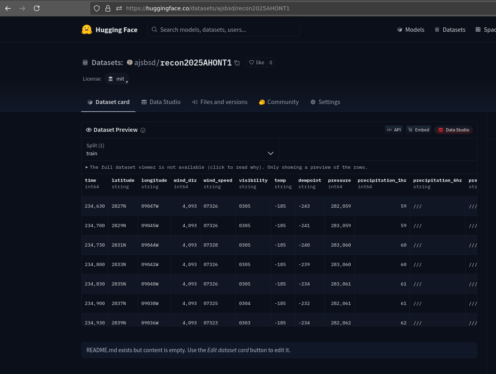

# 🌧️ Weather Text-to-CSV Converter


A Python script that converts raw weather observation `.txt` files into a clean, structured CSV file — ideal for analysis or uploading to Hugging Face Datasets.


### ✅ Input Format Example:
```
259 
URNT15 KBIX 151501
AF303 WXWXA 250415145126303    HDOB 01 20250415
145200 3024N 08855W 0201 ///// //// +308 //// 000000 000 /// /// 25
...
$$
;
```

### ✅ Output Format (CSV):
```csv
time,latitude,longitude,wind_dir,wind_speed,visibility,temp,dewpoint,pressure,precipitation_1hr,precipitation_6hr,precipitation_24hr,snow_depth,source_file
145200,3024N,08855W,0201,/////,////,+308,////,000000,000,///,///,25,file1.txt
```

---

## 📁 Folder Structure

```
weather-txt-to-csv/
├── data/
│   ├── file1.txt
│   ├── file2.txt
│   └── ...
├── txt2csv.py
├── README.md
└── LICENSE
```

---

## 🚀 How to Use

1. Place all `.txt` weather files in the `data/` folder.
2. Run the script:

```bash
python txt2csv.py
```

3. The combined CSV will be saved as:

```
combined_output.csv
```

---

## 🛠️ Requirements

Install dependencies with:

```bash
pip install pandas
```

---

## 📝 Script Features

- Parses semi-structured weather text files
- Skips metadata and header lines
- Combines all files into one CSV
- Adds a `source_file` column for traceability
- Handles variable spacing between fields

---

## 🤝 Contributing

Feel free to open issues or pull requests if you'd like to add features like:

- Automatic unit conversion (e.g., temperature from `+308` → `30.8°C`)
- Date/time parsing (`145200` → `2025-04-15 14:52:00`)
- Integration with Hugging Face Datasets
- CLI arguments or config file support

---

## 📄 License

[MIT License](LICENSE)

Copyright © 2025 Your Name

Permission is hereby granted, free of charge, to any person obtaining a copy of this software and associated documentation files (the "Software"), to deal in the Software without restriction, including without limitation the rights to use, copy, modify, merge, publish, distribute, sublicense, and/or sell copies of the Software, and to permit persons to whom the Software is furnished to do so, subject to the following conditions:

The above copyright notice and this permission notice shall be included in all copies or substantial portions of the Software.

THE SOFTWARE IS PROVIDED "AS IS", WITHOUT WARRANTY OF ANY KIND, EXPRESS OR IMPLIED, INCLUDING BUT NOT LIMITED TO THE WARRANTIES OF MERCHANTABILITY, FITNESS FOR A PARTICULAR PURPOSE AND NONINFRINGEMENT. IN NO EVENT SHALL THE AUTHORS OR COPYRIGHT HOLDERS BE LIABLE FOR ANY CLAIM, DAMAGES OR OTHER LIABILITY, WHETHER IN AN ACTION OF CONTRACT, TORT OR OTHERWISE, ARISING FROM, OUT OF OR IN CONNECTION WITH THE SOFTWARE OR THE USE OR OTHER DEALINGS IN THE SOFTWARE.

---

Generated with chat.qwen.ai
